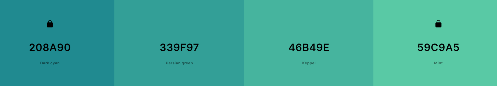

# outfit oracle

## [outfit oracle](https://elfitron.github.io/outfit-oracle/) 

outfit oracle is a web application that generates random outfits from predefined categories. the current 
version includes basic functionality with plans for significant enhancements in future updates.

## aim of the project

the aim of outfit oracle is to provide users with randomly generated outfits for various occasions, 
enhancing their wardrobe choices in a fun and interactive way. 

## table of tontents

- [user stories](#user-stories)
- [colours](#colours)
- [wireframes](#wireframes)
- [progress and errors](#progress-and-errors)
- [technologies used](#technologies-used)
- [future enhancements](#future-enhancements)
- [acknowledgments](#acknowledgments)

## user stories

- as a fashion enthusiast, i want to explore random outfit combinations for inspiration.
- as a user, i want to save my favorite outfits to my personal collection.
- as a frequent traveler, i want to organize outfits by occasions such as work, beach, brunch, etc.
- as a fashion blogger, i want to share stylish combinations and tips with my audience.
- as someone who often forgets what's in their wardrobe, i want to use outfit oracle to easily remember and
- visualize my clothing items, enabling me to create outfits without the need to sift through my entire wardrobe each time.

## colours

some of the colour palettes used prior to the current one. 

## wireframes

## progress and errors

## technologies used

- [html](https://web.dev/learn/html/overview/)- to provide structure and semantic elements 
- [css](https://developer.mozilla.org/en-US/docs/Web/CSS) - to style html elements
- [javascript](https://www.javascript.com) - javascript - applied shuffling functions to display outfit combinations
- [visual studio code](https://code.visualstudio.com/) - to edit the code
- [balsamiq](https://balsamiq.com/) - to create wireframes
- [glorify](https://glorify.com/) - to remove background of all the images
- [google fonts](https://fonts.google.com/) - to import Adamina font
- [font awesome](https://fontawesome.com/) - to create favicons
- [gitHub](https://github.com/) - hosting site used to store the code repository

## future enhancements

- **user clothing uploads**: allow users to upload their own clothing items for outfit generation.
- **advanced filtering**: enable users to filter outfits by style, colour, and occasion.
- **organise wardrobes**: save generated outfits to your personal wardrobe collection
- **integration with social platforms**: share generated outfits directly on social media platforms.

## acknowledgments

a **huge** thank you to my tutor, @kkarir-waes] https://github.com/kkarir-waes, without whom this would not have been possible.
i am *so* grateful for all of your help - xiexie laoshi!

